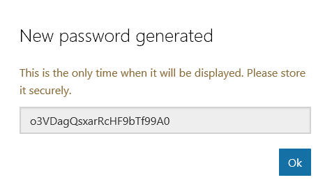
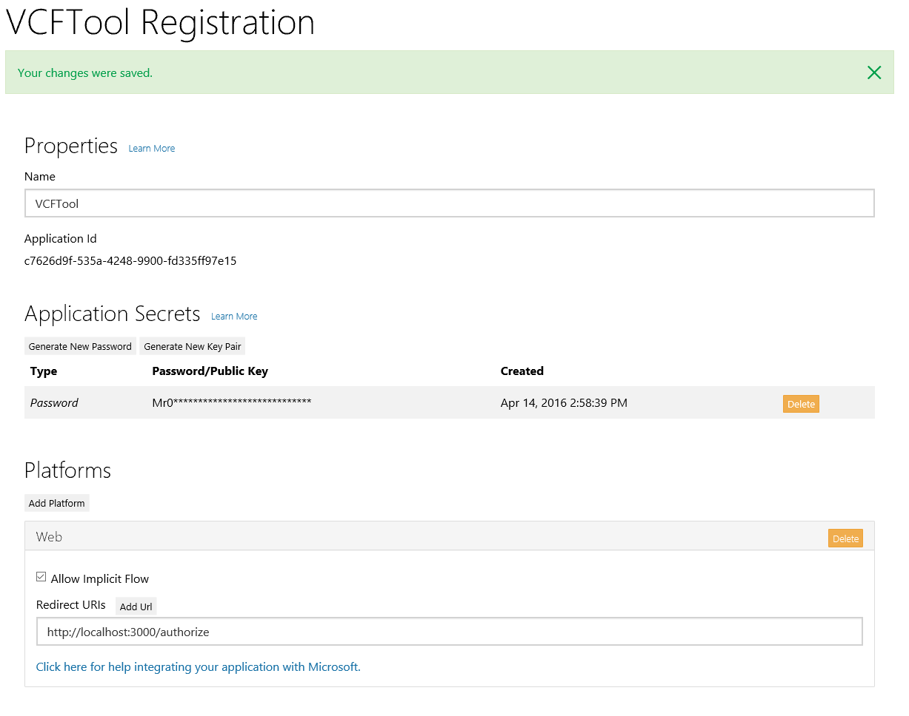

# Office 365 VCF Import/Export Sample #

This Ruby on Rails sample shows how to use the [Contacts API](https://msdn.microsoft.com/office/office365/APi/contacts-rest-operations) via the [ruby_outlook](http://github.com/jasonjoh/ruby_outlook) gem.

## Required software ##

- [Ruby on Rails](http://rubyonrails.org/)
- [ruby_outlook](http://github.com/jasonjoh/ruby_outlook)
- [bootstrap-sass](https://rubygems.org/gems/bootstrap-sass)
- [oauth2](https://rubygems.org/gems/oauth2)
- [carrierwave](https://rubygems.org/gems/carrierwave)
- [vcard](https://rubygems.org/gems/vcard)

## Generate a client ID and secret ###

Before we proceed, we need to register our app to obtain a client ID and secret. Head over to https://apps.dev.microsoft.com to quickly get a client ID and secret. Using the sign in buttons, sign in with either your Microsoft account (Outlook.com), or your work or school account (Office 365).

Once you're signed in, click the **Add an app** button. Enter `VCFTool` for the name and click **Create application**. After the app is created, locate the **Application Secrets** section, and click the **Generate New Password** button. Copy the password now and save it to a safe place. Once you've copied the password, click **Ok**.

Locate the **Platforms** section, and click **Add Platform**. Choose **Web**, then enter `http://localhost:8000/authorize` under **Redirect URIs**. Click **Save** to complete the registration. Copy the **Application Id** and save it along with the password you copied earlier. We'll need those values soon.

Here's what the details of your app registration should look like when you are done.

## Running the sample ##

It's assumed that you have Ruby on Rails installed before starting.

1. Download or fork the sample project.
1. Open a command prompt/shell to the directory where you downloaded the project and run `bundle` to install the required gems.
1. Run `bundle exec rake db:setup` to setup the database.
1. Edit the `.\app\helpers\auth_helper.rb` file. Copy the client ID for your app obtained during app registration and paste it as the value of the `CLIENT_ID` variable. Copy the key you created during app registration and paste it as the value of the `CLIENT_SECRET` variable. Save the file.
1. Run the server by running `rails server` from the command line.
1. User your browser and go to http://localhost:3000.
1. Click the 'Sign in with your Office 365 or Outlook.com Account' button to use the app.

## Copyright ##

Copyright (c) Microsoft. All rights reserved.

----------
Connect with me on Twitter [@JasonJohMSFT](https://twitter.com/JasonJohMSFT)

Follow the [Exchange Dev Blog](http://blogs.msdn.com/b/exchangedev/)